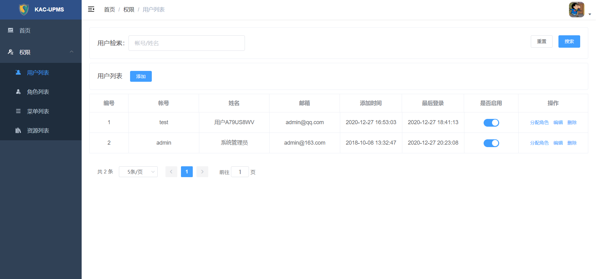

<h1 align="center">uranus-upms</h1>

## 前言

该项目为前后端分离项目的后端部分，前端项目`uranus-upms-web`, [传送门](https://github.com/1020317774/uranus-upms-web.git) 。

## 项目介绍

`uranus-upms` 是一个权限管理系统的后端项目，采用`RESTFul`风格设计，基于 `Spring Boot` + `Mybatis-Plus` 实现。主要包括 `权限管理`、`系统设置` 等功能。

### 项目演示

项目在线演示地址：[uranus-upms-demo](uranus-upms)



### 技术选型

技术 | 说明 | 官网
----|----|----
Spring Boot | Spring Boot 框架 | [https://spring.io/projects/spring-boot](https://spring.io/projects/spring-boot)
Mysql | SQL数据库 | [https://www.mysql.com/](https://www.mysql.com/)
Mybatis | 持久层框架 | [https://mybatis.org/mybatis-3/zh/index.html](https://mybatis.org/mybatis-3/zh/index.html)
Mybatis-Plus | Mybatis增强工具 | [https://baomidou.com/](https://baomidou.com/)
Flyway | 数据库的版本控制工具 | [https://flywaydb.org/](https://flywaydb.org/)
Spring Security | 安全管理框架 | [https://spring.io/projects/spring-security/](https://spring.io/projects/spring-security/)
Redis | key-value存储系统 | [https://redis.io/](https://redis.io/)
JWT | 数字签名 | [https://jwt.io/](https://jwt.io/)

### 项目架构

``` lua
src -- 源码目录
└── java -- 前端页面
    ├── common -- 系统通用
    ├── config -- 系统配置
    ├── generator -- 代码生成器
    ├── modules -- 服务模块
    ├── security -- 安全配置
    ├── UranusApplication -- 服务启动类
    
└── resources -- 资源目录
    ├── db/migration -- flyway配置
    ├── mapper -- Mybatis XML
    ├── application.properties -- properties配置
    ├── application.yml -- yaml配置
    ├── application-dev.yml -- dev环境配置
    ├──application-prod.yml -- prod环境配置
    ├──generator.properties -- 代码生成器配置
    
└── test -- 单元测试

```

## 启动步骤
- 克隆项目到本地：`git clone https://github.com/1020317774/uranus.git`
- 访问地址：[http://127.0.0.1:8080](http://127.0.0.1:8080) 进行接口调试;
- 访问文档：[http://127.0.0.1:8080/](http://127.0.0.1:8080) 进行接口调试;

## 许可证

[Apache License](./LICENSE)

Copyright (c) 2020-present Knox
